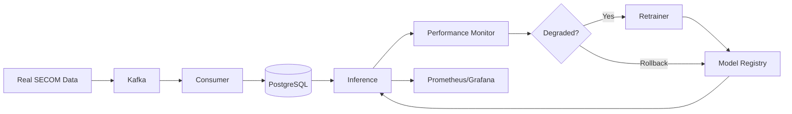

# Distributed ML Pipeline

MLOps system with automated continuous learning, drift detection, and model rollback for manufacturing quality prediction.

## Quick Start

```bash
# Download SECOM dataset
curl -o /tmp/secom.data https://archive.ics.uci.edu/ml/machine-learning-databases/secom/secom.data
curl -o /tmp/secom_labels.data https://archive.ics.uci.edu/ml/machine-learning-databases/secom/secom_labels.data

# Start services
docker-compose up -d

# Train initial model
docker-compose exec trainer python pipeline/model_trainer.py --auto-deploy
```

Access monitoring:
- **Grafana**: http://localhost:3000 (admin/admin)
- **Prometheus**: http://localhost:9090
- **API**: http://localhost:8004

## Architecture



## Features

- **Continuous Learning**: Retrains when accuracy < 85% or F1 < 0.80
- **Model Rollback**: Reverts to previous model if new model performs worse
- **Drift Detection**: KS-test on 590 features every 6 hours
- **Retry Logic**: Database operations with exponential backoff
- **Advanced ML**: TabNet, deep learning, ensemble models
- **CI/CD**: Automated testing, linting, Docker builds

## Training

```bash
# Traditional models (LogisticRegression, RandomForest, GradientBoosting)
python pipeline/model_trainer.py --data-days 7 --auto-deploy

# Advanced models (TabNet, deep learning, ensembles)
python pipeline/model_trainer.py --data-days 7 --model-type tabnet --auto-deploy
```

## API Usage

```bash
# Prediction
curl -X POST http://localhost:8004/predict \
  -H "Content-Type: application/json" \
  -d '{"features": {"feature_0": 1.2, "feature_1": -0.5, ...}}'

# Health check
curl http://localhost:8004/health

# Model info
curl http://localhost:8004/model/info
```

## Monitoring

**Prometheus Alerts**:
- Model accuracy < 85% for > 1 hour
- Drift detected on > 10% of features
- Inference latency p95 > 100ms
- Service down > 5 minutes

**Grafana Dashboards**:
- Model performance trends (accuracy, F1, precision, recall)
- Drift detection heatmap
- Prediction latency distribution
- Rollback events timeline

## Testing

```bash
# Unit + integration tests
pytest tests/ -v --cov=pipeline

# CI simulation
make ci-test
make ci-lint
```

## Design Decisions

**Real Data**: Uses actual SECOM dataset (1567 samples) with time-based train/test split (80/20). Batch replay enables continuous operation.

**Drift Simulation**: Gradual feature distribution shifts on 20% of features to test continuous learning.

**Model Rollback**: Monitors new models for 1 hour, rolls back if accuracy drops > 5% or F1 drops > 0.05.

**Kafka**: Used for learning distributed systems despite being overkill for this scale. Could be replaced with direct database writes.

## Known Limitations

- Single-instance deployment (no horizontal scaling configured)
- Model files stored locally (use S3/MinIO for distributed setup)
- No authentication or rate limiting (add for production)
- Finite dataset with batch replay (vs infinite synthetic generation)

## License

MIT
